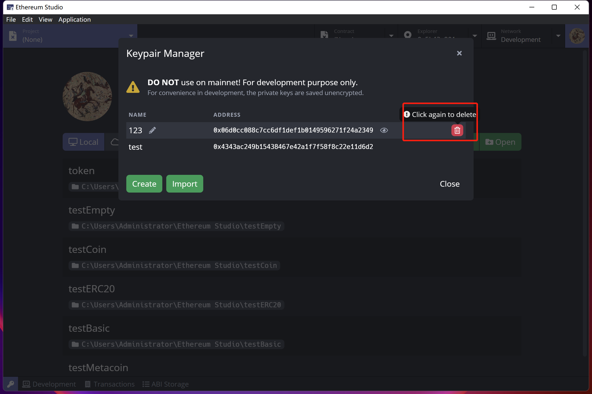

# Keypair Manager

Click the "key" icon in the bottom left corner of the panel, and one can see the "Keypair Manager" panel.

In the "Keypair Manager" panel, there is a reminder that keypairs kept in the manager should not be used on mainnet. For the convenience of development, the keypairs are all unencrypted. Since keypairs used on mainnet containing ETH and keypairs, including private keys. Private keys will easily be checked by anyone using a desktop client under the account. It is perilous to lose ETH to keep mainnet keypairs in the manager. After all, the private key can be the identity to transfer assets on the blockchain.

## Create Keypair

Click the "Create" button on the bottom left corner. One can generate a random keypair for later deployment.

In the "Create Keypair" window, there will be a newly generated address and private key in "Keypair info". The newly created key pair has no name, and one can input a name for it as long as the new name is not the same as other keypairs. Otherwise, there would be an error message reminding the name has been used. Names can be changed in "Keypair Manager" later since it has no relation with keypair information but for remembering.

The keypair will show its name rather than address string in the Block Explorer panel since names may contain a more meaningful message for developers to recognize.

In "Regenerate", an inverted triangle will show one can either regenerate a private key or regenerate a mnemonic. In the blockchain, mnemonic means a fixed-length number of words that mnemonic can generate to one and only one private key for the user. Compared with private keys, including random permutations with characters and numbers, the mnemonic can be easily remembered by a user who wants to keep this critical information in a meaningful way.

If one wants another keypair to remember, one can click "Regenerate" and have a different private key or mnemonic with a corresponding address. After settling keypair and name, one can click "Create" in the bottom right corner of the panel and save this keypair in "Keypair Manager".

## Delete Keypair

After creating several keypairs, one can delete the unwanted keypair by double-clicking the "trash can" icon at the right end of the keypair. Please remember that the keypair deleted can not be restored unless one has kept the keypair information in another place.

## Import Keypair

Except for creating or recreating a random key pair, one can also import an existed keypair by clicking the "Import" green button on the bottom left. There will be an "Import Keypair" window after clicking. One can copy the existed keypair information and paste it into the box. The corresponding address is automatically generated after inputting the private key or mnemonic. A green "checkmark" will be at the end of the box, indicating a correct input under rules. Then, click the "Import" button on the bottom right corner to import the keypair.

### Import MetaMask Mnemonic

In MetaMask, one uses a mnemonic as a private key to enter the wallet. One can import the mnemonic of MetaMask as a login MetaMask wallet from a newly installed browser extension of MetaMask. Users can check detailed information here **Link (**[https://docs.metamask.io/guide/common-terms.html#words-are-hard](https://docs.metamask.io/guide/common-terms.html#words-are-hard)**)**.
