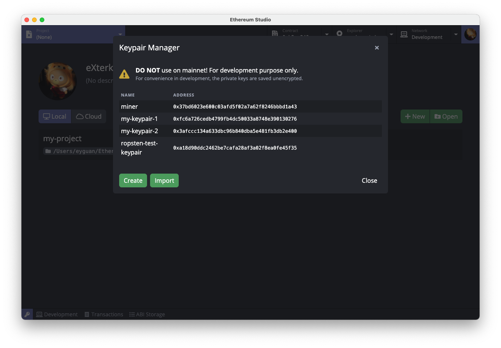
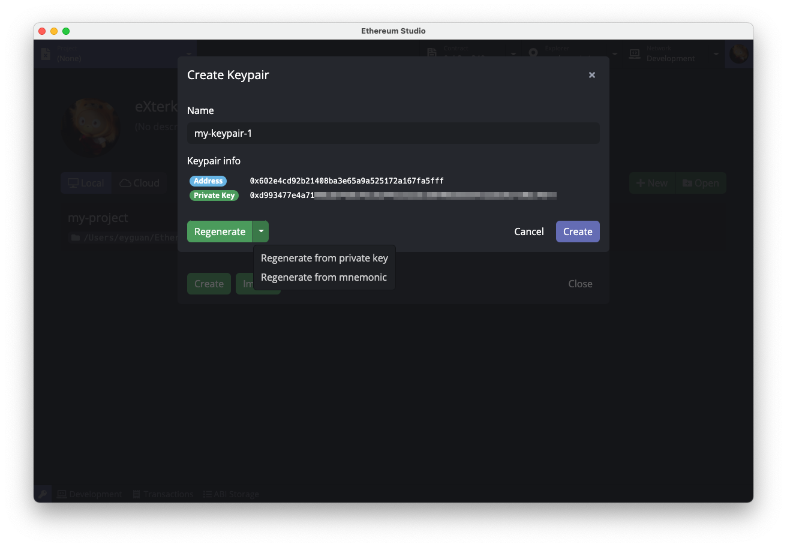
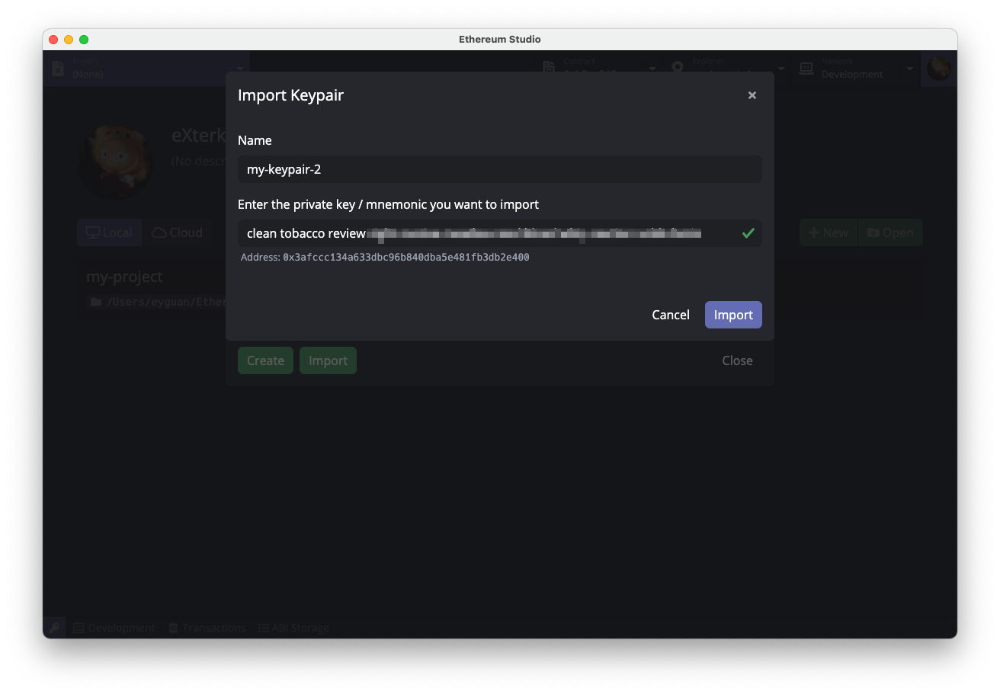

## Keypair Manager

After entering the main interface, users need to create some keypairs. Open Keypair Manager by clicking the key icon at the bottom left on any interface of Ethereum Studio.

Users can create, import and manage keypairs in the keypair manager. Click *Create* button and follow the prompts to key in a name and create a keypair. When creating or editing a keypair, users can set an alias for the keypair identification purpose in later use. Ethereum Studio creates new keypairs with private keys by default but mnemonic is also supported. Simply click on the arrow next to *Regenerate* button and select from the drop-down list.

In case of importing keypairs, click *Import* button on the bottom-left and put in the private key / mnemonic you want to import. Ethereum Studio will automatically parse it and the corresponding address will be indicated below if the key is deemed valid. Click *Import* again to complete the process.

Before we proceed, please create a few keypairs in the Keypair Manager. We'll be using three keypairs in the following demos, namely `miner` , `my-keypair-1` , `my-keypair-2` .

**Please note: private keys and mnemonics exclusively prove ownership of a keypair. Please securely store them and DO NOT share them with others under any circumstances. Leaking or losing private keys or mnemonics may lead to permanent loss of digital assets.**
