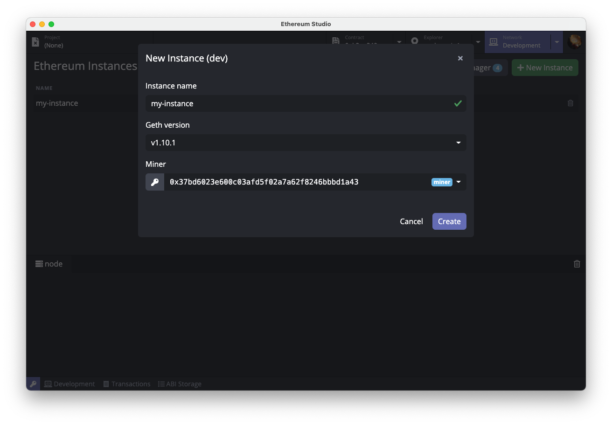
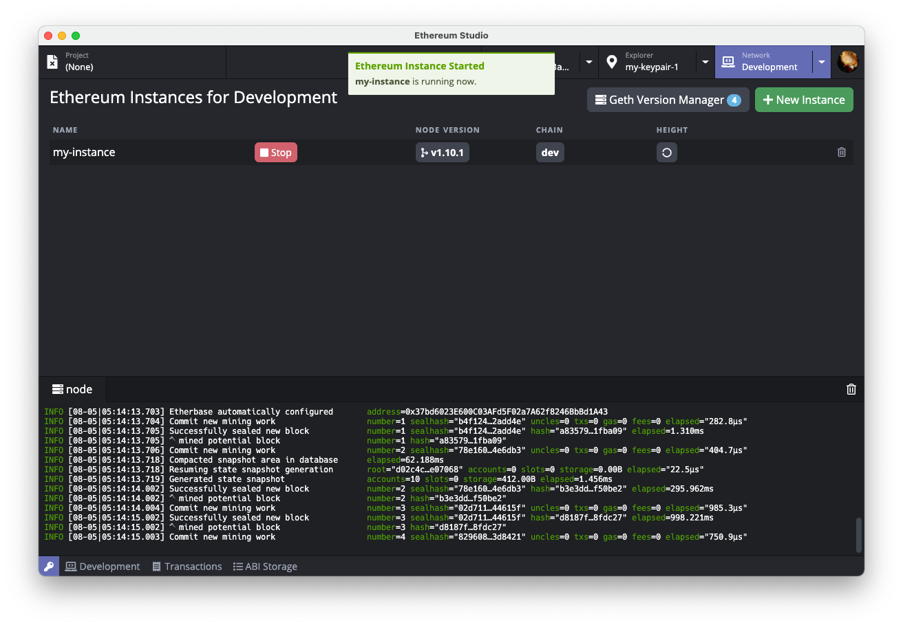
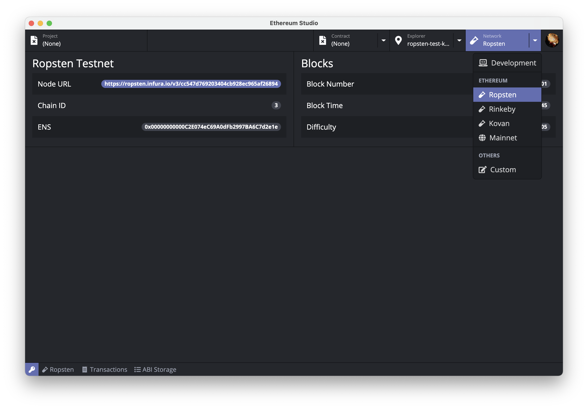

## Network Manager

### **Local Ethereum Node**

Click *Network* tab to switch to Network Manager. Users can manage Ethereum nodes and Geth installation, including installing, deleting Geth images, or create, delete and run Ethereum node with a specific version of Geth.

Click *New Instance* button on the top-right corner to pull up the new instance (node) wizard, then key in a name for the node and specify the version for the underlying Geth, and the address of Miner. Finally, click *Create* to complete the process.

When creating an Ethereum node, users need to specify a Miner from the keypairs stored in Keypair Manager. Miner mines block locally for the Ethereum node. Here, we pick `miner` keypair in our demo, which will also be the genesis address and thus will be issued some tokens upon the first startup of our local Ethereum node.

When the node is successfully created, click the green *Start* button to start Ethereum node. Users may also view node log in the log viewer below.

### **Ethereum Testnet / Mainnet**

Ethereum Studio has built-in configurations for connection to three Ethereum testnets [Ropsten](https://github.com/ethereum/ropsten), [Rinkeby](https://www.rinkeby.io/) and [Kovan](https://kovan-testnet.github.io/), as well as the Ethereum mainnet. Click on the arrow net to *Network* tab and select the network you wish to connect from the drop-down list.

### **Custom Network**

Ethereum Studio supports custom network connections. Click on the arrow next to *Network* tab, and select *Custom Network* from the drop-down list. Follow the prompt to put in designated node URL information to connect.

