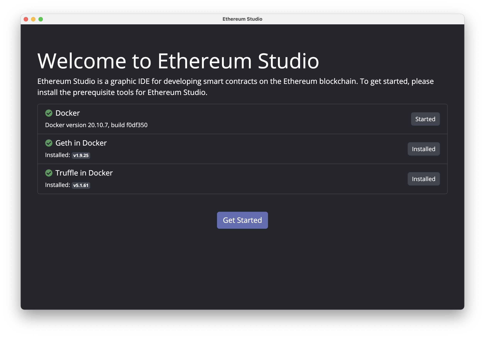

## Project Editor / Block Explorer

When Ethereum node is up and running, click *Explorer* tag on the top-right corner to switch to Block Explorer. Block Explorer provides a tool to query information at a given address that usually includes token information and transaction history.

Click the arrow next to *Explorer* tag, and select the address you would like to query from the drop-down list. Users should now see the information being pulled up on the screen. Meanwhile, users may also manually key in an address to view its corresponding information. Ethereum Studio currently does not support display of transaction history on local Ethereum nodes. Switching to testnet or mainnet to display transaction history associated with the address.

Block Explorer will display all holdings of ERC-20 tokens that are listed in [Trust Wallet](https://github.com/trustwallet/assets/blob/master/blockchains/ethereum/tokenlist.json) at the address when connecting to mainnet.

For user's convenience, Ethereum Studio's block explorer comes with a few widgets. Invoke it by clicking on the buttons next to the address column:

- Click *Transfer* button to initiate a quick transfer. This transfer widget supports transfer(s) of ETH or any ERC-20 holding in the account to a designated recipient. Select the transaction token and key in corresponding parameters, then click *Sign and Push* button to execute. Every transaction will be recorded in the [Transaction History](https://github.com/ObsidianLabs/EthereumStudio/blob/master/README.md#Transaction-History) for reference purposes. Now, let's make use of this transfer widget to move 10,000 ETH from `miner` to `my-keypair-1`.

- When connecting to testnet, a click on *Faucet* button will direct user to the website where he / she can apply for test tokens for development / test purposes. All faucet tokens are test tokens and have no monetary value.