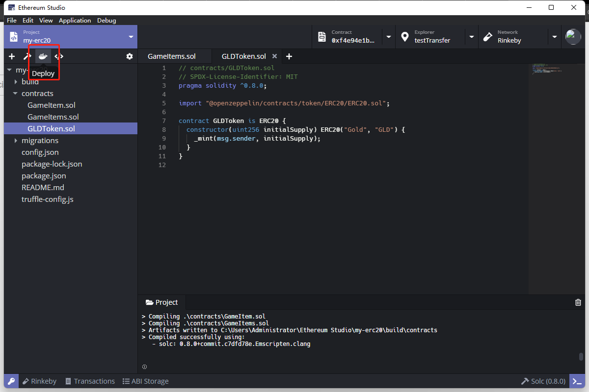
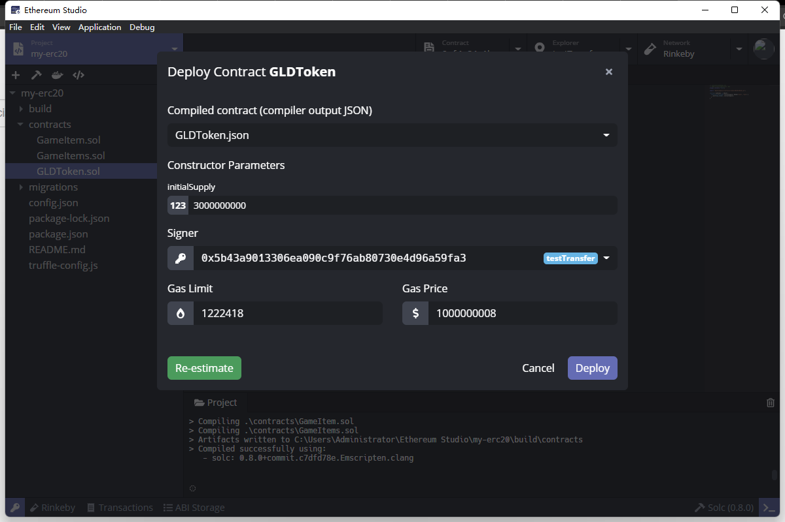
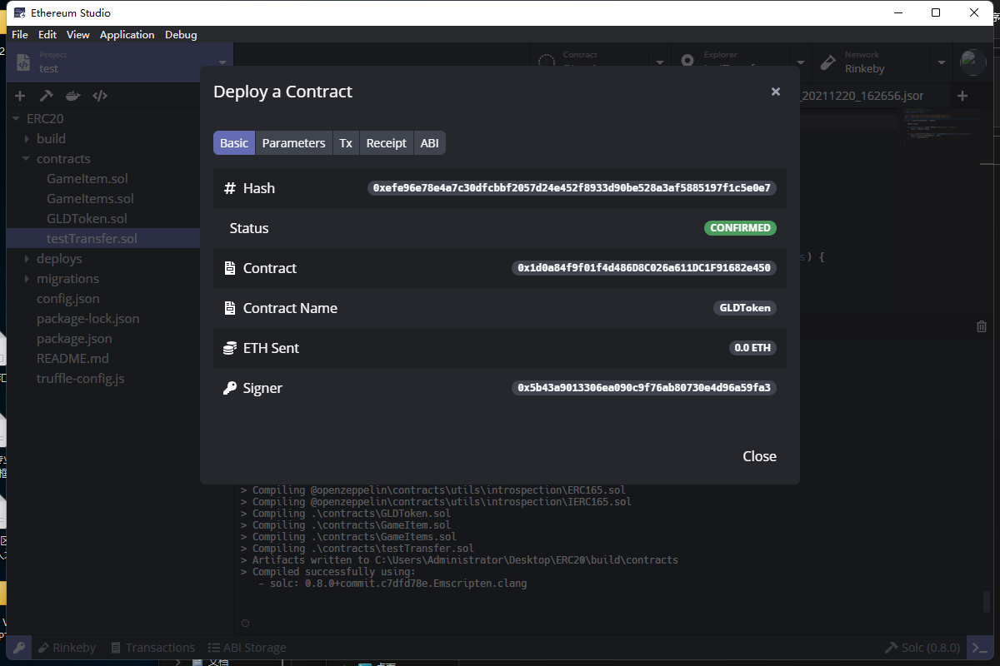
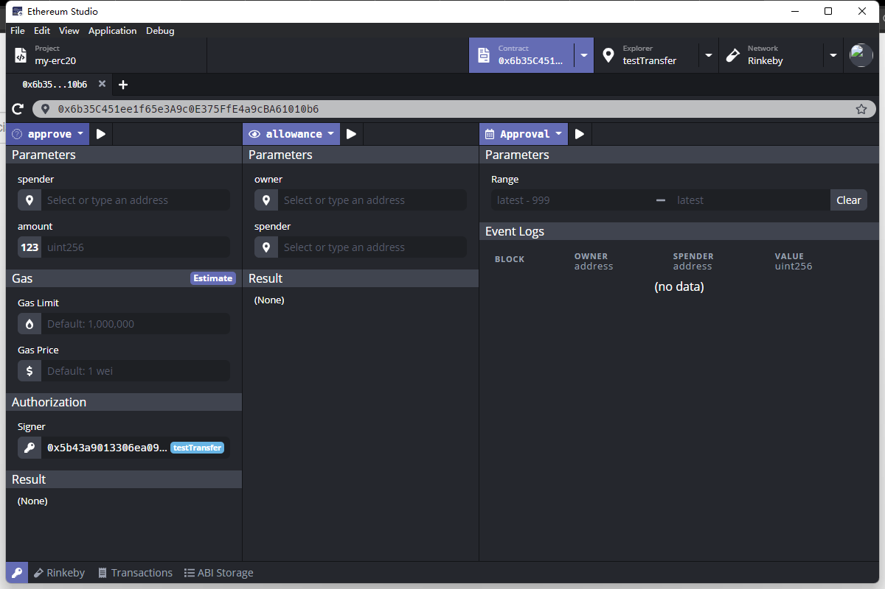
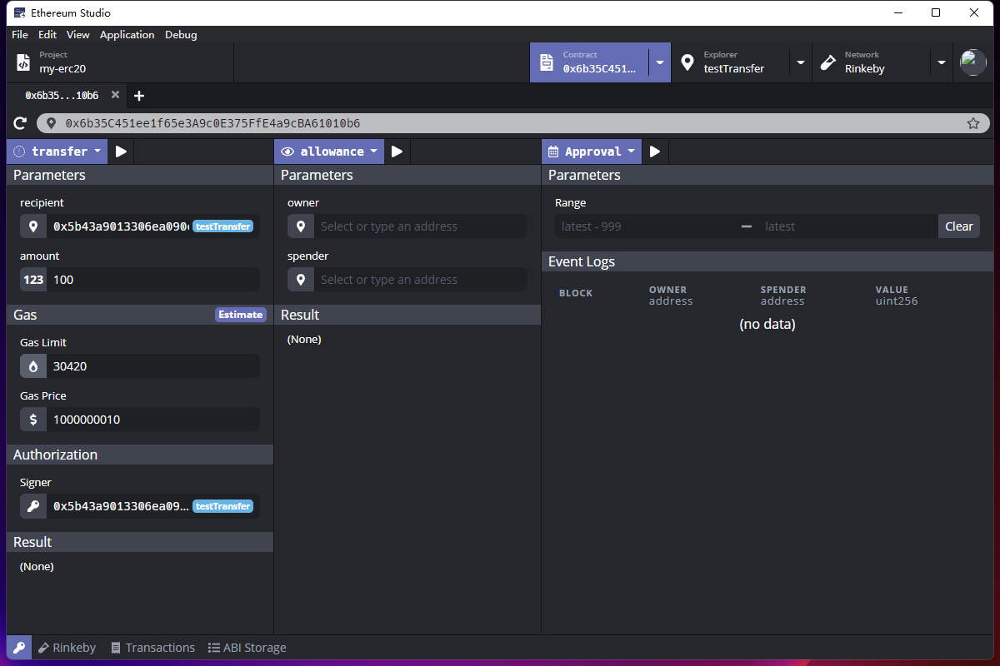
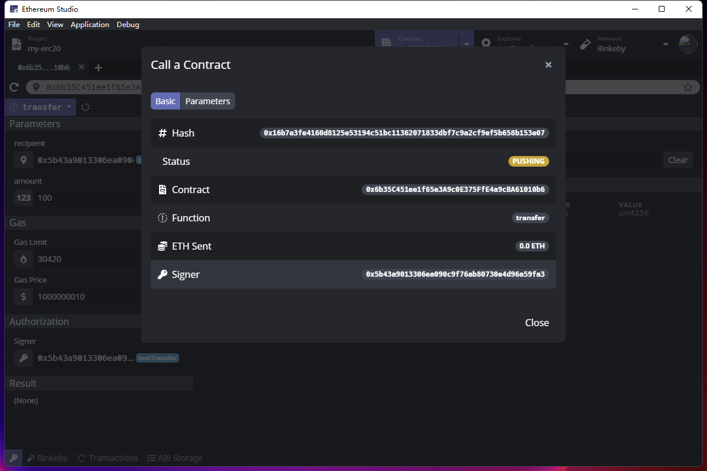
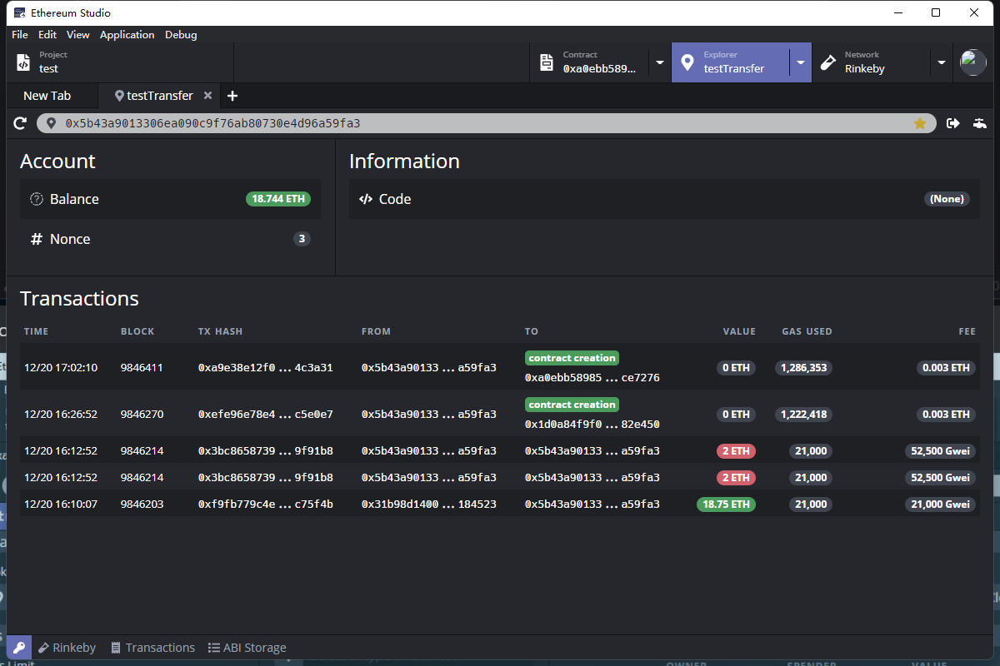

## Deploy Solidity Contracts

After compile the project, click the “Docker” icon on the upper left panel to deploy the selected contract.

Select the JSON file with the contract name that one would like deploy. Set “Constructor Parameters” as the contract needs.  Now the “initialSupply” is 3000000000. Then click bottom right button to “Estimate” the Gas Limit” and “Gas Price”.

After deploying successfully, there is a window with detailed information. Now the contract is deployed on the address:  0x6b35C451ee1f65e3A9c0E375FfE4a9cBA61010b6  and one can click the address and it would turn to the “Contract” interface.

One can choose the “transfer” function. Then one can set ”Parameters”  and “Gas” respectively. Now one select the “recipent” as the address of “testTransfer” and set amount of token to transfer as 100. After all the parameters settled, one can click the triangel icon beside “transfer” to excute function.

After the pushing state, the contract is deployed successfully. If one want to see the past transaction detail, one can select “Explorer” on the upper right panel.

