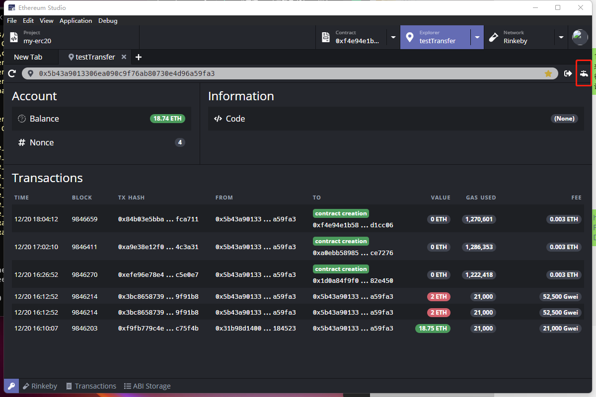
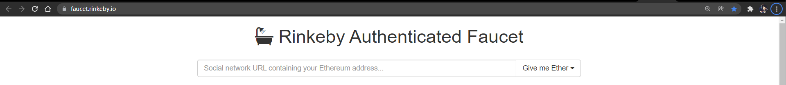
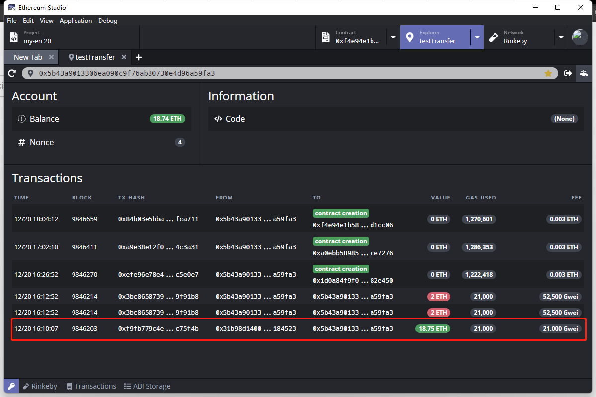

## Get test token on Rinkeby

Click the upper right “Faucet” icon and one will jump to the **Rinkeby Authenticated Faucet.** 

Follow the instruction of getting test token via Twitter or Facebook, so one would get Test Ethereum on Rinkeby.

After the request of Test Ethereum, one can check the Explorer Transactions on Rinkeby Network of detailed information.

