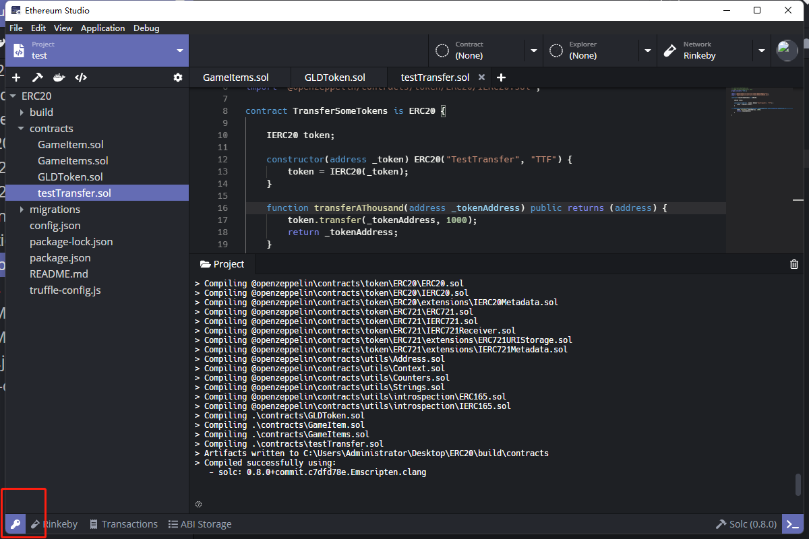
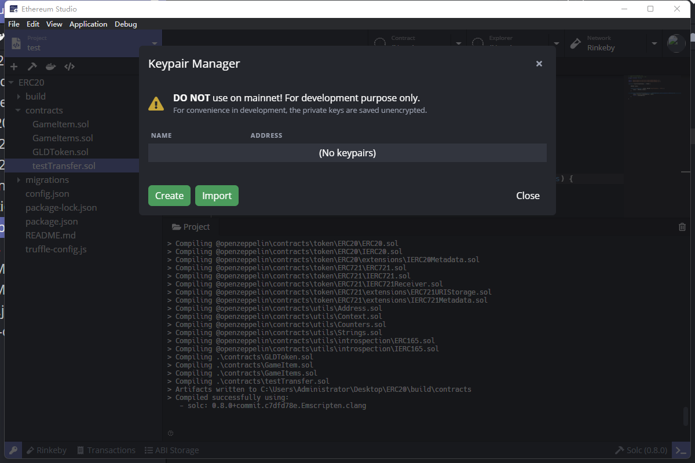

## Manage Keypair

Switch the “Network” to the testnet “Rinkeby” at the upper right panel. 

Click the purple key icon in the bottom left coner and create the keypair so one can log into the testnet.

Click the “Create” and one can generate the“Keypair info” including “Address” and “Privete Key” in the testnet **Rinkeby**. By keeping the “Private Key” secretly, one can control the assets in the “Address”. The “Address” will be used on the later process.

Input the keypair name and one can save this keypair and later choose it in the “Explorer” as identity.

~~This “Keypair” named “testTransfer”  is public for everyone to test on **Rinkeby**.~~ 

~~Address: 0x5b43a9013306ea090c9f76ab80730e4d96a59fa3~~

~~Private Key: 0xda2c60819fdf1e5e68e6693ae2d1f00f8e03ba2a2eaf46c25c66fa0855db30c7~~

