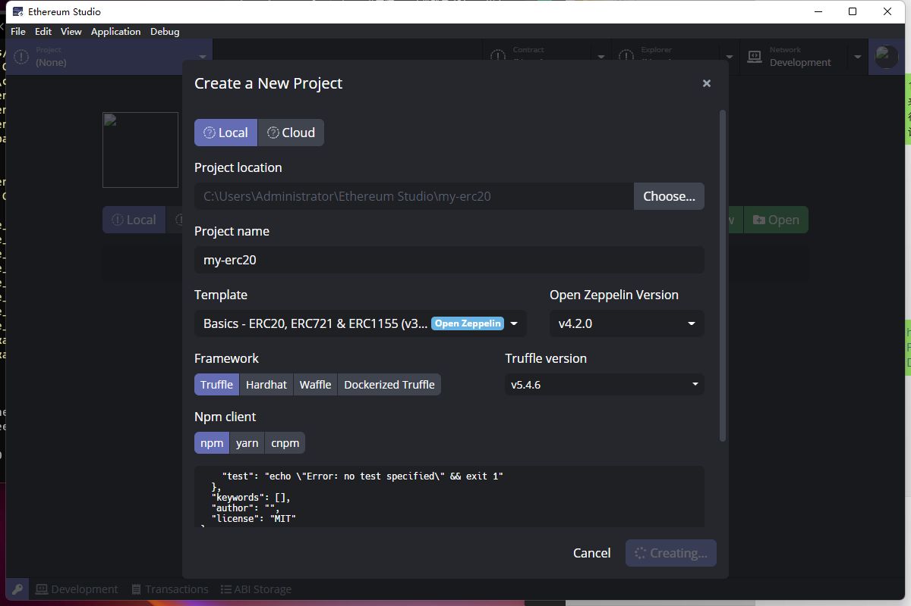
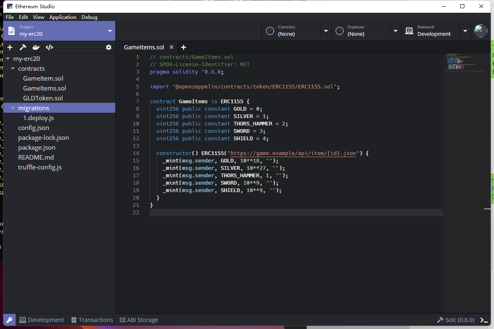

## Quick Start

Create a ERC20 project in Ethereum Studio. The “Project name” is “my-erc20“ and the “Project location” is automaticly settled as “C:\Users\Administrator\Ethereum Studio\my-erc20“(This is the default path in Windows PC).

Set “Template” as “Basics - ERC20, ERC721 & ERC 1155” so one can save time of import basic projects in later development process. The ”Open Zeppelin Version” is the latest version now and one can select other versions.

Select ”Framework” as “Truffle” and  ”Npm client” as  “npm”. This is the default project choice and one can change it as one wants. Those selections will be automaticly used as command line in Terminal when one compile or deploy the projects. 

One can see the projects editor after creating process. The left panel shows project structure and function icon. The upper right shows “Contract”, “Explorer” and “Network”.

