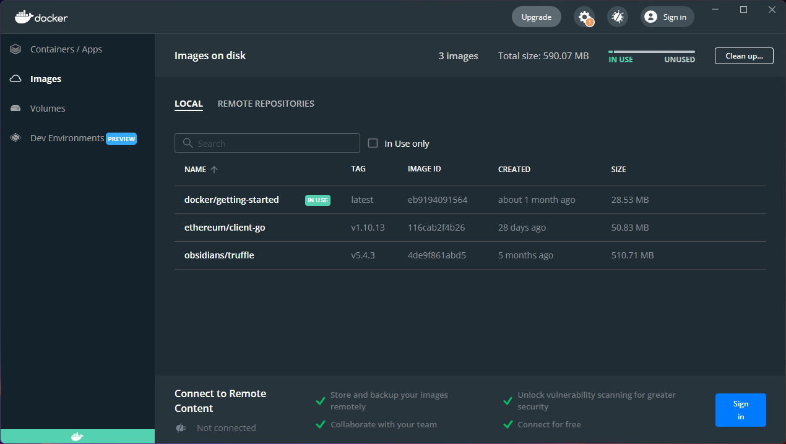
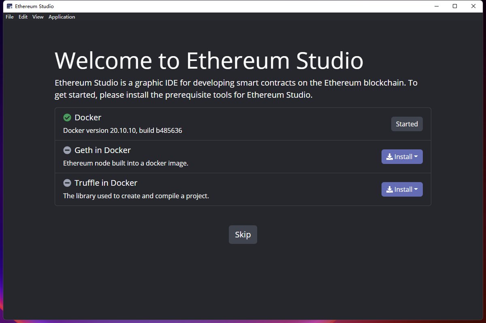
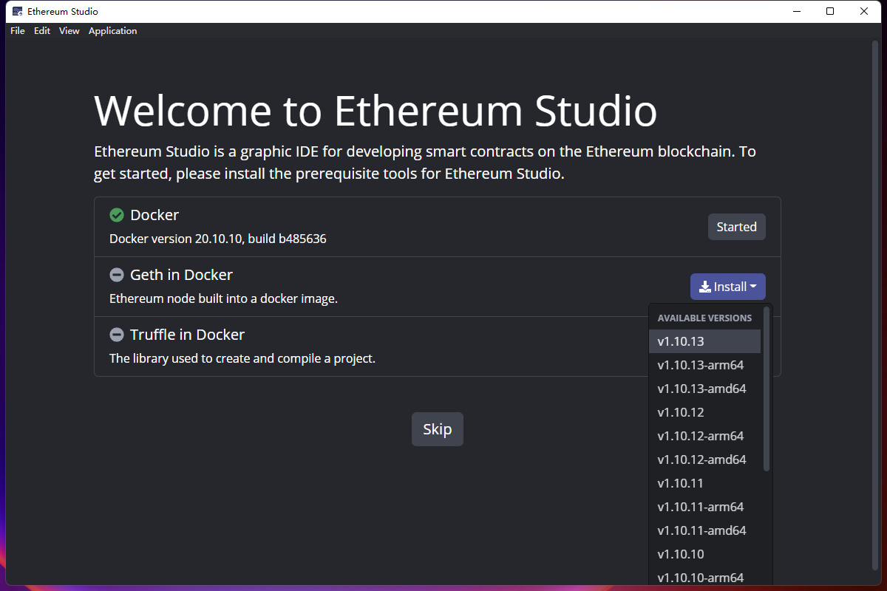
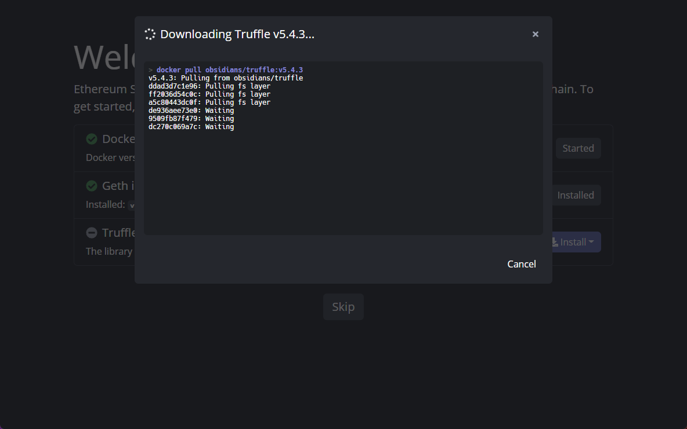
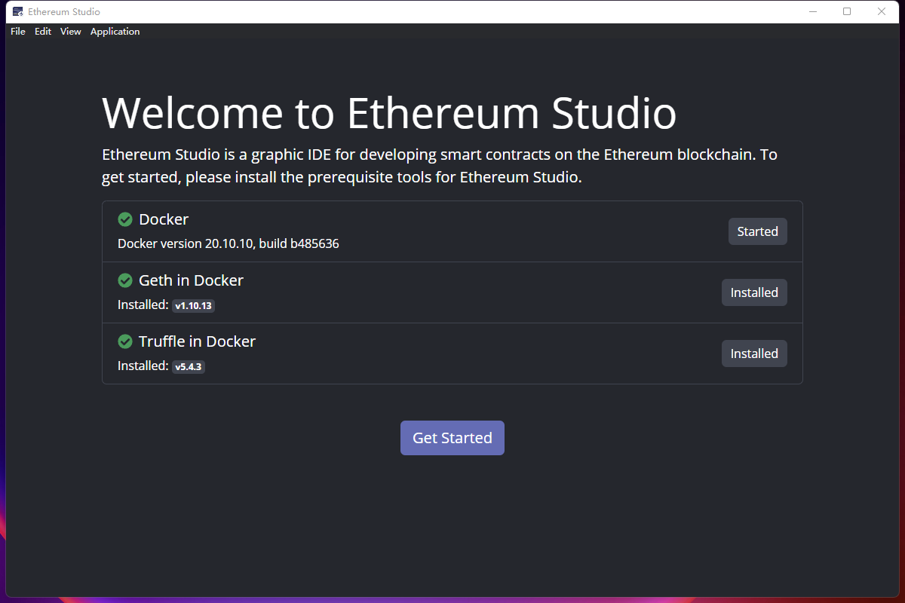
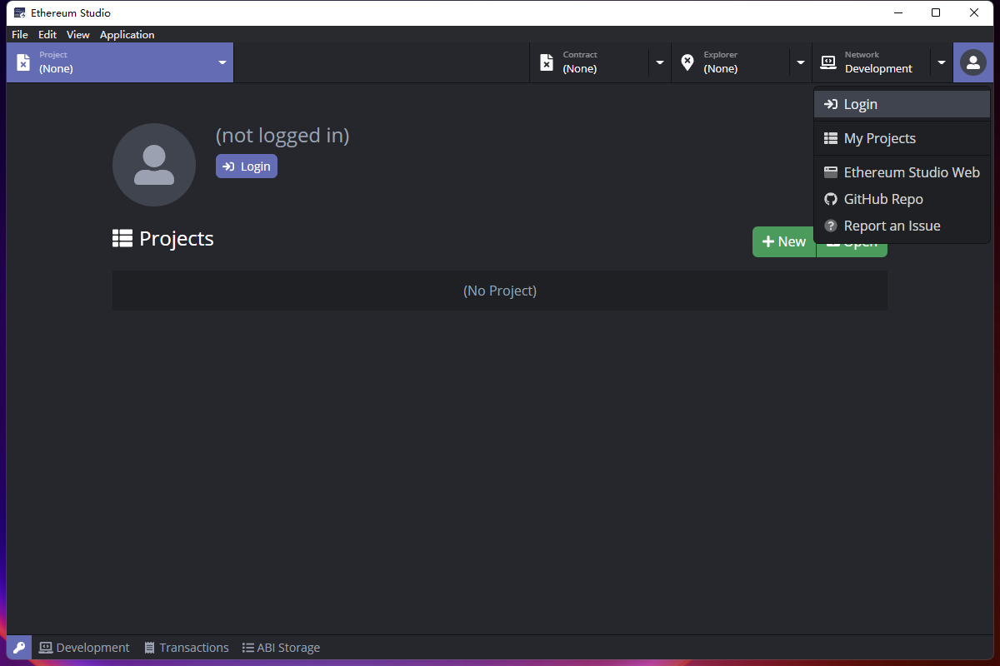
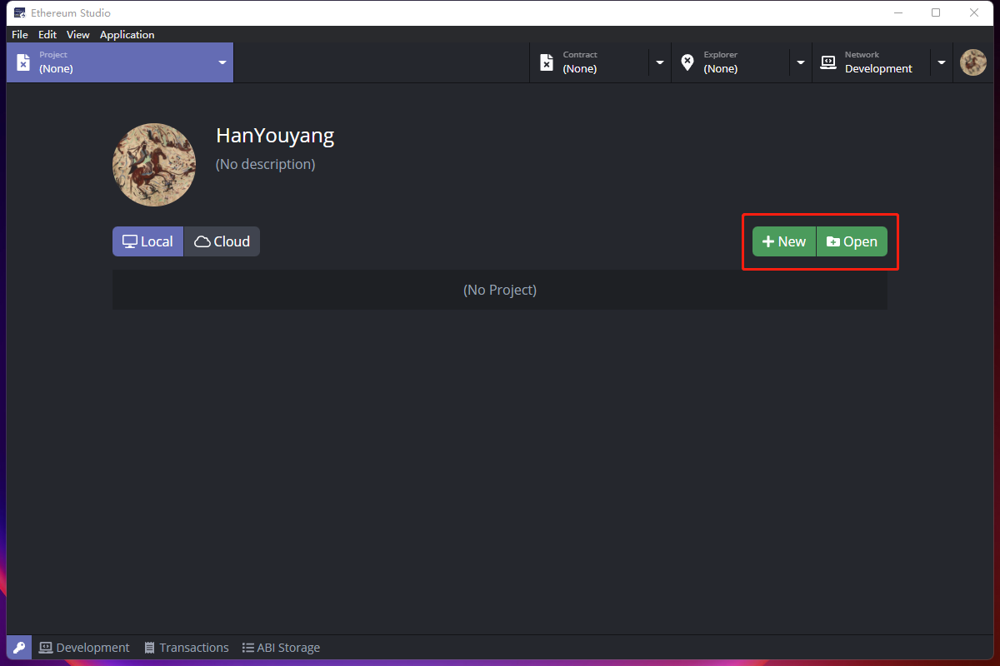

### Install Dependencies

Using Ethereum Studio requires several dependencies including **Docker**, **Ethereum Node** and **Ethereum Truffle**. All three docker files are needed if one wants to run Ehereum Studio. The moudles are installed in docker client like this:

If there is any missing dependency in docker, one can install it through the “Welcome” page. 

One can install the avaliable versions in the list for “Geth in Docker”. It is same for “Truffle in Docker” too.

After all dependencies are installed, one can click the “Get Started” and there will be the Project interface. 

One can log in via one’s Github account, so there would be the memeory of cloud project for the user to restore.

After log in one can start one’s own project or just create new project through the button of  Project page.

